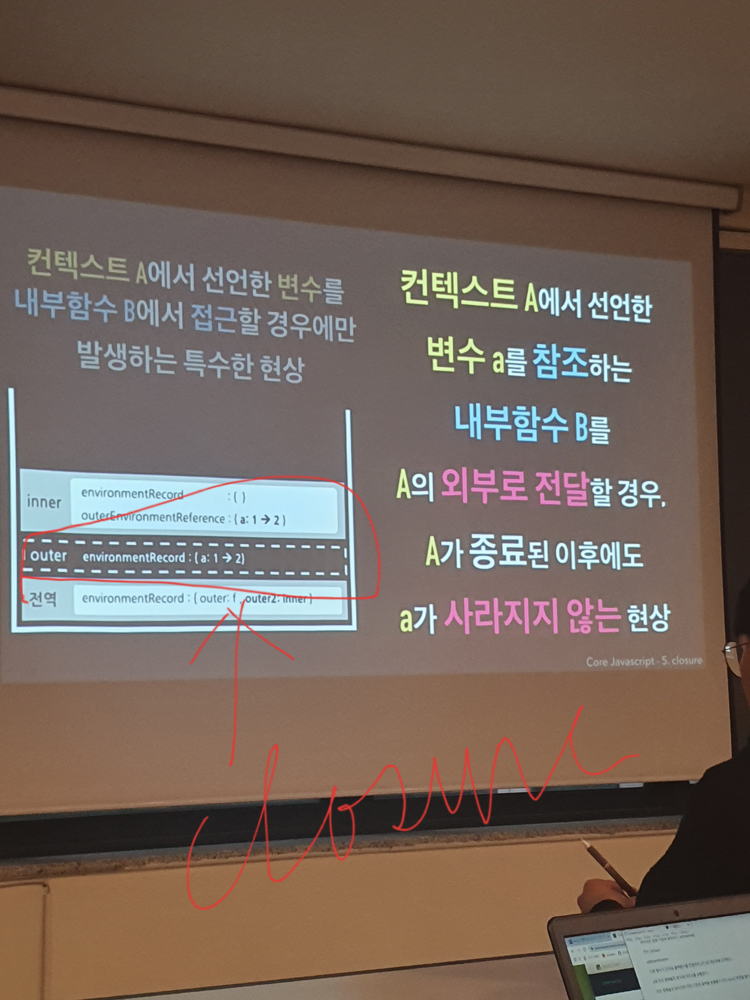
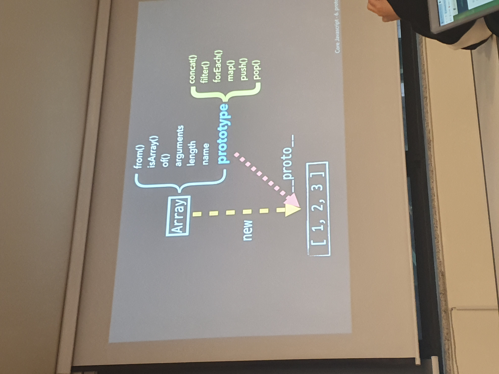
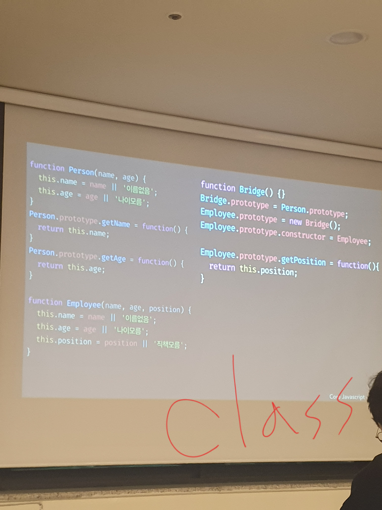

### [저자특강] 코어 자바스크립트: 핵심 개념과 동작 원리로 이해하는 자바스크립트 프로그래밍
  - Speaker: 정재남
  - Date: 20191130 14~18
  - Place: 위플레이스 강남점
---

#### 1. Data Types

  - 총 2개로 구성되어 있다. Primitive Type, ReferenceType
  - 둘을 확실히 구분짓고, 충분히 이해하고 넘어가야 함
  - 메모리에는 주소와 데이터가 구분되어 있음
  - 선언이 먼저고 할당이 나중이다. 동시에 써도 선언이 먼저 되고 할당은 나중에 이루어짐 -> var a = 'abc';, var obj = {a: 1, b: 'bbb'};
  ```
    var obj = {
      a: 1,
      b: 'bbb'
    };

    obj.a = 2;

    /**
      참조형은 메모리를 한단계 더 건너뛰어서 값을 변경한다.
    **/
  ```

  ```
    var obj = {
      x: 3,
      arr: [3,4]
    };

    /**
      참조형안에 참조형을 넣으면 메모리를 계속 확보해야 하기 때문에 메모리 사용량이 많아질 수 밖에 없게 된다.
    **/

    obj.arr = 'abc'

    /**
      위와 같이 하게 되면, 배열 참조가 없어지기 때문에 자바스크립트 엔진에 의해(참조 카운터 0) GC대상이 된다.
    **/
  ```

#### 2. Execution Context (실행 컨텍스트)

  - 정의(?): 실행에 필요한 배경이 되는 조건/환경 => 동일한 조건/환경을 지니는 코드뭉치, 를 실행할 때 필요한 조건/ 환경정보 => (추상적인 개념이긴 하지만 최종 결론)함수를 실행할 때 필요한 환경정보를 담은 객체
  - 동일한 조건/환경을 지니는 코드뭉치 = ES5기준 함수 or 전역공간

  ```
    var a = 1;
    function outer() {
      console.log(a); // 첫번째, outer context
      function inner() {
        console.log(a); // 두번째, inner context -> 'Undefined' 가 출력된다. inner environmentRecord의 var a 호이스팅에 의해서
        var a = 3;
      }
      inner();

      console.log(a); // 세번째, outer context
    }
    outer();
    console.log(a); // 네번째, global context

    /**
      call stack :
        1. global context push
        2. outer context push
        3. inner context push
        4. inner context pop
        5. outer context pop
        6. global context pop
    **/

    /**
      1. 전역컨텍스트
      2. environmentRecord
        2-1. 변수 a 선언
        2-2. 함수 outer 선언
      3. 변수 a에 1 할당
      4. outer 함수 호술 -> OUTER Excevution Context 활성화
      5. Outer 컨텍스트
      6. Outer environmentRecord
        6-1. 없음
      ... 정리 필요
    **/
  ```
  - Lexical Environment
    - environmentRecord = 현재문맥의 식별자, HOISTING(실행 컨텍스트의 제일 위로 식별자 정보를 끌어올린다.)
      - function hoisting은 해당 funciton 전체를 끌어올린다.
    - outerEnvironmentReference = 현재 문맥에 관련 있는 외부 식별자 정보 => 해당 컨택스트 바깥에 있는 컨택스트 = Scope Chain -> Lexical Environment의 outerEnvironmentReference로 인해 외부로 접근은 가능하지만 inner에서 선언한 변수로는 접근이 불가능하다.
      - Scope Chain => 안에서 부터 바깥(outerEnvironmentReference을 이용하여)으로 쭉 해당 값을 찾아 가는것, 무조건 가까운것만 찾는다. 찾아내면 더이상 아우터로 찾으러 가지 않는다.

  - Variable Environment
  - Lexical Environment
    - environmentRecord: 현재 문맥의 식별자(hoisting)
    - outerEnvironmentReference: 

#### 4. This

  - 실행 컨택스트가 활성화 되는 순간에 ThisBinding. 함수가 호출될때 실행 컨택스트가 만들어짐 = 함수가 호출 될때 This가 결정되기 때문에 호출하는 방식에 따라 This는 언제든지 바뀔 수 있다.

  - 전역공간에서 this를 출력하면 = Browswer에서는 window / Node.js에서는 global
  - 함수 호출시에도 전역공간에서의 this와 같다. = window / global

  ```
    function a() {
      console.log(this); // window / global이 출력
    }
    a();

    function b() {
      function c() {
        console.log(this);  // window / global이 출력(버그 혹은 특성이라고 생각), 이 문제 때문에 ES6에서는 arrow function으로 바로 상위 함수의 this를 가져오게 했음.
      }
      c();
    }
    b();
  ```

  - 메소드 호출시 .앞이 this임
  ```
    var a = {
      b: function() {
        console.log(this); // a가 this다
      }
    }
    a.b();

    var a = {
      b: {
        c: function() {
          console.log(this); // b가 this다
        }
      }
    }
    a.b.c();
  ```
  - 내부함수에서의 우회법
  ```
    var a = 10;
    var obj = {
      a: 20,
      b: function() {
        console.log(this.a); // 20

        function c() {
          console.log(this.a); // 10, 함수로 호출되어서 여기에서의 this는 window를 참조함(버그?) => 여기서도 this를 썻을때, 20을 출력하게 할 순 없을까?
        }
        c();
      }
    }
    obj.b();

    // ***우회법***
    var a = 10;
    var obj = {
      a: 20,
      b: function() {
        var _this = this; // 꼼수이지만 ES6의 arrow함수가 나타나기전까진 이 방법이 많이 쓰였다.
        console.log(this.a); // 20

        function c() {
          console.log(_this.a); // 20
        }
        c();
      }
    }
    obj.b();
  ``` 

  - callback 호출시
    - call(즉시호출), apply(즉시호출), bind(새로운 함수 생성) 함수 먼저 확인 = 명시적으로 this를 지정할 수 있음
      - **첫번째 인자로 this를 설정 할 수 있음
      - api문서를 보면 thisArg를 항상 첫번째 인자로 받음, 나머지는 메타표기법으로 생략가능
      ```
        function a(x, y, z) {
          console.log(this, x, y, z);
        }

        var b = {
          c: 'eee'
        };

        a.call(b, 1, 2, 3);
        a.apply(b, [1,2,3]);  //배열안의 값이 하나하나 인자로 들어감

        var c = a.bind(b);  //this가 b가 되는 새로운 함수를 생선한것
        c(1, 2, 3); // 나머지 인자 3개 x,y,z

        var d = a.bind(b, 1, 2);
        d(3);
      ```

  ```
    //0
    var callback = function() {
      console.dir(this);
    };

    var obj = {
      a: 1,
      b: function(cb) {
        cb();
      }
    };
    obj.b(callback); //전역 객체가 출력됨 이유는, 앞에 .에 없기 때문에 함수로써 호출된것이라서

    //1
    var callback = function() {
      console.dir(this);
    };

    var obj = {
      a: 1,
      b: function(cb) {
        cb.call(this);
      }
    };
    obj.b(callback);  //obj가 출력된다.

    //2
    var callback = function() {
      console.dir(this);
    };

    setTimeout(callback, 100);  // 전역 객체가 출력

    // 3
    var callback = function() {
      console.dir(this);
    };

    var obj = {
      a: 1
    }
    setTimeout(callback.bind(obj), 100);  //obj가 출력됨 : 테스트 해봐야함
  ```
  - 기본적으로는 함수의 this와 같다.
  - 제어권을 가진 함수가 callback의 this를 명시한 경우 그에 따른다.
  - 개발자가 bind함수를 통해서 this를 제어 할 수 있다.

  - 생성자함수 호출시 = 인스턴스를 가르킴
  ```
    function Person(n, a) {
      this.n = n;
      this.a = a;
    }
    var a = new A('첫번째', '두번째');

    //해당 새성자가 this로 바인딩 된다.
  ```

#### 5. Callback Function
  - 정의: 호출해서 돌려줄 함수
  - 제어권
  ```
    // ex.1
    setInterval(cb, 1000);  //setInterval 자체는 첫번째 인자로 callback함수를 받는다.

    var cb = function() {
      console.log('1초마다 실행될 겁니다.');
    };

    // ex.2
    var arr = [1,2,3,4,5];
    var entries = [];
    arr.forEach(function(v, i) {
      entries.push([i, v, this[i]]);
    }, [10, 20, 30, 40, 50]); //forEach에 thisArg를 추가 할 수 있음

    console.log(entries);

    // ex.3
    var arr = [1,2,3,4,5];
    var obj = {
      vals: [1,2,3],
      method: function(v, i) {
        if(this.vals) {
          console.log(this.vals, v, i);
        } else {
          console.log('None');
        }
      }
    };
    arr.forEach(function(e) {
      console.log(this);
    }, obj);
    arr.forEach(() => {
      console.log(this);  //전역 컨텍스트가 찍힘
    }, obj);
    arr.forEach(obj.method, obj);
  ```

#### 5. Closure
  - 함수가 선언할 당시 Lexical Environment란 전역 객체를 가르킴 = 실행 컨텍스트 A와 내부 함수B가 콤비가 되어 무언가를 한다!!
  - B의 outerEnvironmentRefernce는 A의 environmentRecord를 참조
  - 

  ```
    var outer = function() {
      var a = 1;
      var inner = function() {
        console.log(++a);
      };
      inner();
    }
    outer();

    var outer = function() {
      var a = 1;
      var inner = function() {
        return ++a;
      }
      return inner;
    }

    var outer2 = outer();
    console.log(outer2());
    console.log(outer2());
  ```
  - 함수 종료 후에도 사라지지 않는 지역변수를 만들 수 있다.
  - 초기화 세팅 정도로 클로져를 만들어 놓고, 계속 실행되면서 전체에서 사용되어 진다.

  ```
    function a() {
      var localA = 1;
      var localB = 2;
      var localC = 3;
      return {
        get a() { return localA;},
        set a(v) { localA = v;},
        get b() { return localB + localC;},
        set b(v) { throw Error('read only); }
      };
    }

    var obj = a();
  ```

#### 6. Prototype
  - 
  - 메소드 상속 및 동작원리
    ```
      //ex.1 (this의 개념을 다시 정리 해야함)
      function Person(n, a) {
        this.name = n;
        this.age = a;
      }

      Person.prototype.setOlder = function() {
        this.age += 1;
      }

      Person.prototype.getAge = function() {
        return this.age;
      }

      var gomu = new Person('', 10);
      var iu = new Person('', 5);

      gomu.setOlder();
      gomu.getAge();
    ```
  - Prototype Chaning
    - __proto__가 생략되었다고 생각하고 호출되는 함수의 prototype에 부를 함수가 없으면 계속 상위 prototype을 찾아서 함수를 호출
    ```
      // ex.1
      var a = [1,2,3];
      console.log(a.toString());  //a에는 toString()이란 함수가 없음에도 사용 가능하다.

    ```

#### 7. Class
  - Javascript는 원래 protype을 이용해 구현되어 Javascript의 class는 추상적인 개념임
  - static method는 접근 불가능
  ```
    function Person(n, a) {
      this.n = n;
      this.a = a;
    }

    Person.getStaticName = function() {return this.n;}  //static method
    Person.prototype.getName = function() {return this.n;}
    Person.prototype.getAge = function() {return this.a;}

    var p = new Person('jy', 10);
    console.log(p.getStaticName()); //error
    console.log(p.getName()); // jy
  ```
  - 
  - 